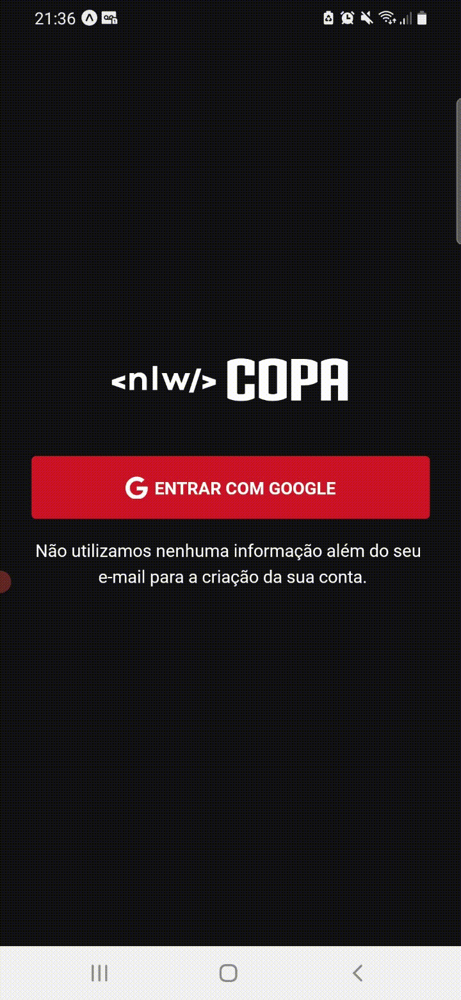
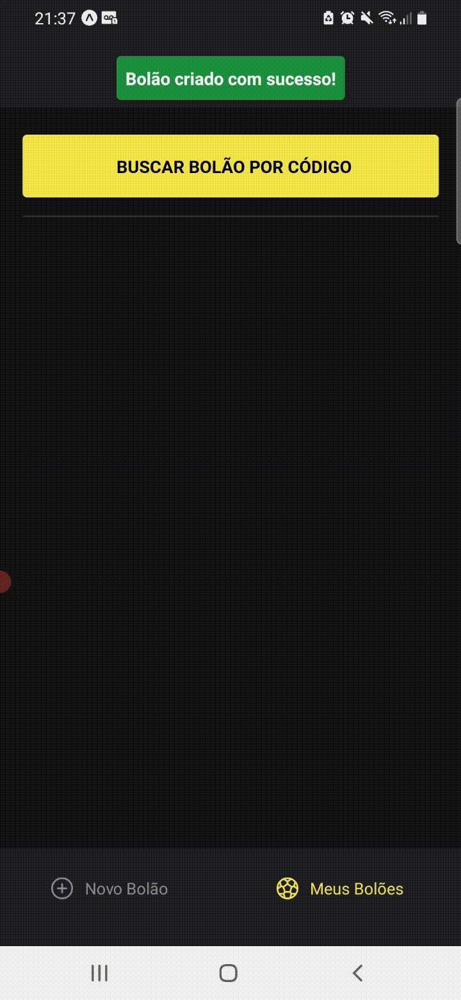

  
  

# Projeto

Idealizado pela Rocketseat durante o NLW de novembro, o projeto consiste em uma aplicação web para criar um bolão e uma aplicação mobile para criar, entrar e gerenciar bolões da Copa do Mundo 2022, tudo feito em cima do backend criado com o Prisma.

### Utilização da aplicação web:

  
  

### Utilização da aplicação mobile:

## Tecnologias Principais

- [React](https://reactjs.org/)
- [TypeScript](https://www.typescriptlang.org/)
- [Expo](https://expo.dev/)
- [Prisma](https://www.prisma.io/)

## Layout

Para visualizar é necessário fazer login no Figma, então é só [clicar aqui](https://www.figma.com/community/file/1169028343875283461).

### Agradeço à todos da equipe da Rocketseat por proporcionar esse desafio e essa semana de muito aprendizado!

